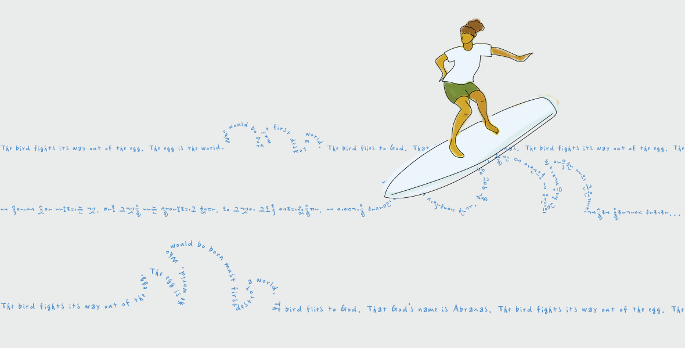

# song-tiigger.github.io

## 첫번째 포트폴리오

- 사용한 소스: html, css

**반응형** 웹은 *구현* ***하지 않았음***

> 미완성
>> 완성하기

***

`print('Hello World');`

http://www.naver.com

[송티거 깃허브](https://github.com/song-tiigger)

[구글](http://www.google.com, 검색 사이트)

### 링크로 삽입하기

### 깃에 올린 이미지 삽입하기

